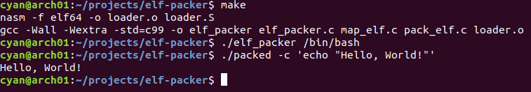

# elf-packer

A packer encrypts ELF64 binaries like dacryfile.

- Search through a binary to find a sufficient gap to inject a payload
- Encrypt the .text section
- Inject a payload. The entry point is the base of a payload

This program expects ELF64 binaries produced with the default link map as input and might not work with others.
